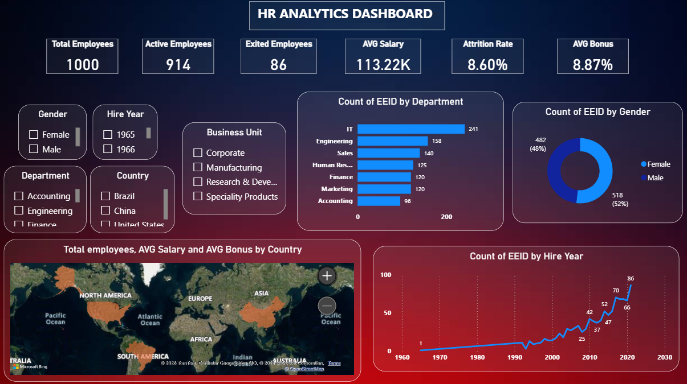

# HR Employee Analytics Dashboard

## 📊 Project Description

This project is an interactive **HR Employee Analytics Dashboard** developed using **Microsoft Power BI**. The main objective of this project is to analyze employee data and provide meaningful insights into workforce structure, employee performance, hiring trends, salary, bonus, and employee attrition.

The dashboard helps HR teams and business managers understand important workforce metrics and identify trends that can support better decision-making.

## 🎯 Project Objectives

* Analyze overall employee headcount
* Monitor active and exited employees
* Calculate and analyze employee attrition rate
* Understand employee distribution across departments and business units
* Analyze gender distribution
* Track employee hiring trends over time
* Analyze average salary and bonus
* Understand employee distribution across different countries
* Provide interactive filters for detailed analysis

## 📌 Key KPIs

The dashboard includes important HR metrics such as:

* **Total Employees**
* **Active Employees**
* **Exited Employees**
* **Average Salary**
* **Average Bonus**
* **Attrition Rate**

## 🔍 Key Insights & Analysis

The dashboard provides analysis based on:

* Department
* Business Unit
* Gender
* Country
* Hiring Year
* Employee Status

Interactive slicers allow users to filter the dashboard and analyze employee data from different perspectives.

## 🧹 Data Preparation

The dataset was cleaned and transformed using **Power Query**. The data preparation process included handling missing values, correcting data types, transforming columns, and preparing the dataset for analysis.

A dedicated **Date Table** was also created to support time-based analysis and improve the data model.

## 🧮 DAX & Data Modeling

**DAX (Data Analysis Expressions)** was used to create calculated measures for important HR KPIs and analysis.

The Power BI data model connects the employee data with a dedicated Date Table to enable accurate time-based calculations and reporting.

## 🛠️ Tools & Technologies

* Microsoft Power BI
* Power Query
* DAX
* Microsoft Excel
* Data Cleaning
* Data Modeling
* Data Visualization

## 📊 Dashboard Preview

## 📁 Project Files

* `HR_ANALYTICS_Project.pbix` — Power BI report
* `./HR_EMP_Dashboard.png` — Dashboard screenshots
* `README.md` — Project documentation

## 💡 Skills Demonstrated

**Power BI | DAX | Power Query | Data Cleaning | Data Modeling | Data Visualization | Excel | HR Analytics**

## 🚀 Project Outcome

This project demonstrates how raw employee data can be transformed into an interactive and user-friendly HR analytics dashboard. It provides a centralized view of workforce metrics and enables users to explore employee trends and patterns through interactive visualizations and filters.

